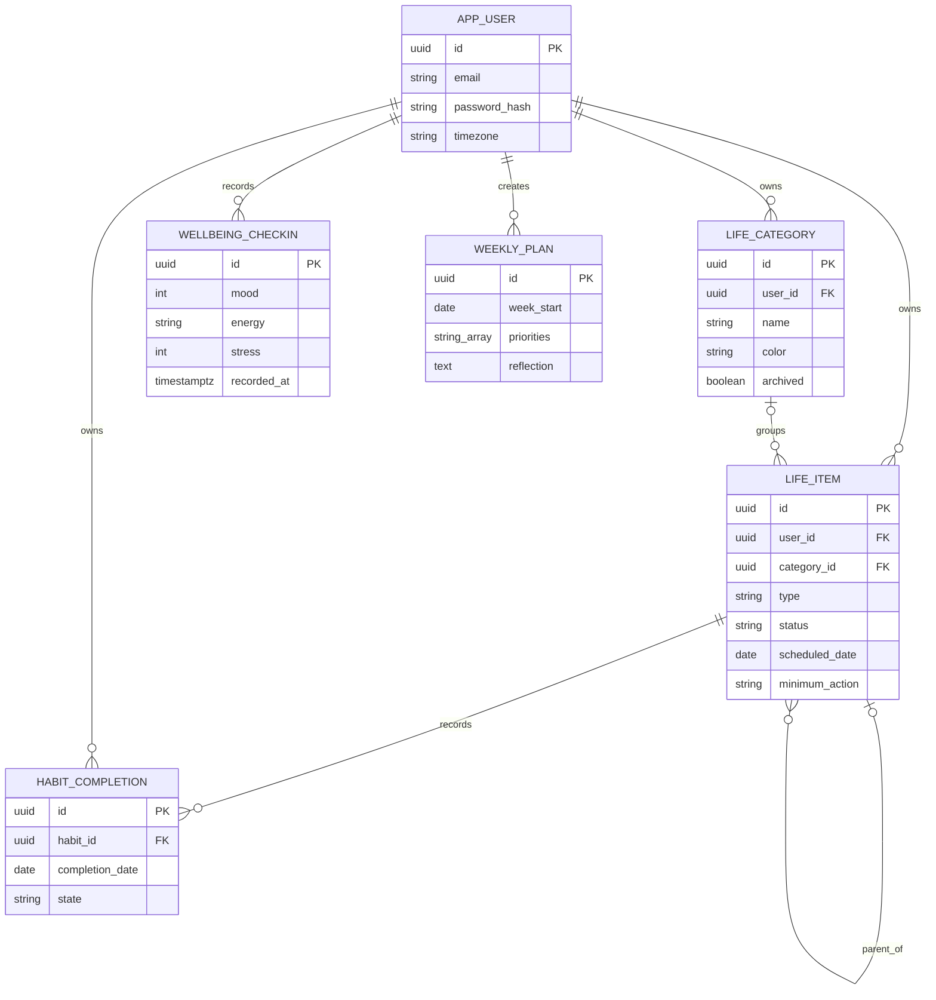

# Database schema

```mermaid
erDiagram
  APP_USER ||--o{ LIFE_CATEGORY : owns
  APP_USER ||--o{ LIFE_ITEM : owns
  APP_USER ||--o{ WELLBEING_CHECKIN : records
  APP_USER ||--o{ WEEKLY_PLAN : creates
  LIFE_CATEGORY o|--o{ LIFE_ITEM : groups
  LIFE_ITEM o|--o{ LIFE_ITEM : parent_of
  LIFE_ITEM ||--o{ HABIT_COMPLETION : records
  APP_USER ||--o{ HABIT_COMPLETION : owns

  APP_USER { uuid id PK string email string password_hash string timezone }
  LIFE_CATEGORY { uuid id PK uuid user_id FK string name string color boolean archived }
  LIFE_ITEM { uuid id PK uuid user_id FK uuid category_id FK string type string status date scheduled_date string minimum_action }
  HABIT_COMPLETION { uuid id PK uuid habit_id FK date completion_date string state }
  WELLBEING_CHECKIN { uuid id PK int mood string energy int stress timestamptz recorded_at }
  WEEKLY_PLAN { uuid id PK date week_start string_array priorities text reflection }
```

User IDs are present on every sensitive aggregate to enforce ownership in every repository query. UTC `timestamptz` values are stored for instants; local dates remain date-only.
